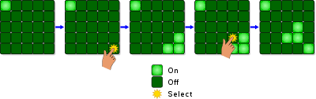
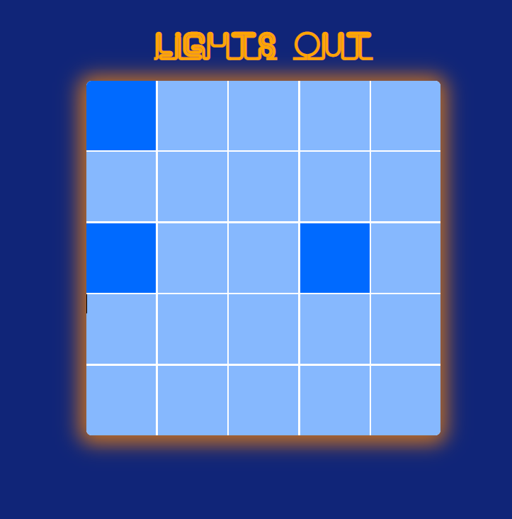
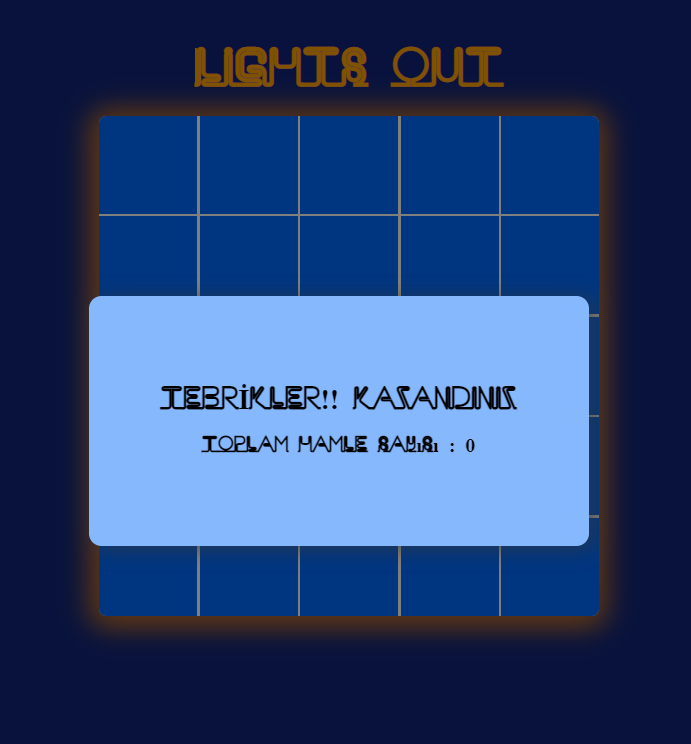

# Lights Out Game

#### Lights Out Game 90lı yıllarda çıkan bir el konsol oyunudur. Amaç 5x5 ızgarada'ki tüm hücrelerin ışıklarını yakmaktır. Izgara'daki hücrelerden herhangi birine dokunduğunuzda, dokunulan hücre ve dokunulan hücrenin sağ,sol,üst ve alt hücreleri etkileşime girer. Bu etkileşim ile hücreler eğer ışıkları açıksa kapar, kapalıysa açar.

 

## Metotlar ve Teknolojiler
#### Uygulama React kütüphanesi ile yazılmıştır. Uygualamda styling için sass kullanılmıştır. Uygulama her click için hamle sayısı tutar ve kazanılması durumunda bir popup ile hamle sayısını bildirir.

